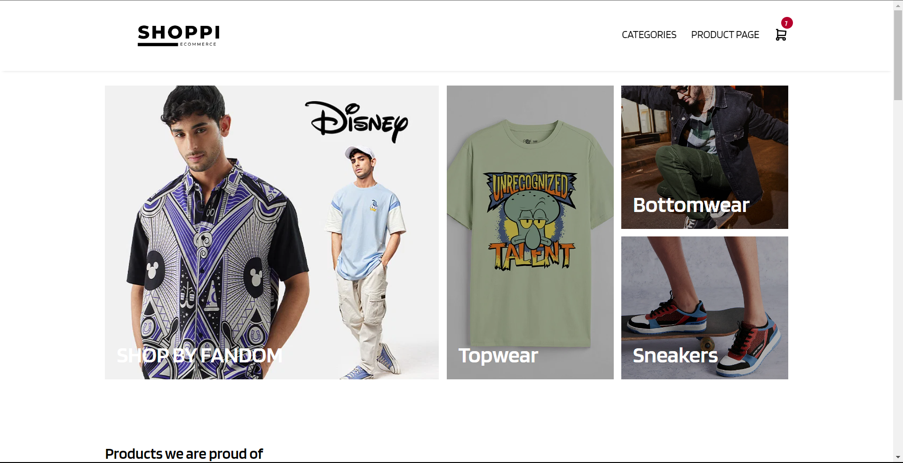

# Shoppi Ecommerce 🛍️

  
  
## Features

- **User Authentication :** 🔐 Allow users to sign up, log in, and manage their profiles.
- **Product Listings :** 🍽️ Display a list of Product with details and Product items.
- **Menu Navigation :** 📜 Users can browse Product menus and add items to their cart.
- **Toast Notifications :** 🍞 Display toast notifications for various user actions, such as successful order placement or item removal from the cart.
- **Filter Restaurants :** 🍲 Allow users to filter product based on shirt, jeans, bag and tshirt.
- **Carousel for Images :** 🎠 Use carousels to showcase product images or items in a visually appealing way.
- **Footer Section :** 🦶 Include a footer section with links to important pages, contact information, and social media.
- **Removing Items from Cart :** 🗑️ Users can remove individual items from their shopping cart without clearing the entire cart.
- **Clear Cart Functionality :** 🛒 Provide an option for users to clear their entire shopping cart with a single action.

## Getting Started

Follow these instructions to set up and run the project locally on your machine.

### Prerequisites

- Node.js and npm installed on your system.

### Installation

1. Clone the repository: `git clone https://github.com/your-username/InstantEats.git`
2. Navigate to the project directory: `cd InstantEats`
3. Install dependencies: `npm install`
4. Start the development server: `npm start`

---

Happy ordering! 🚀
